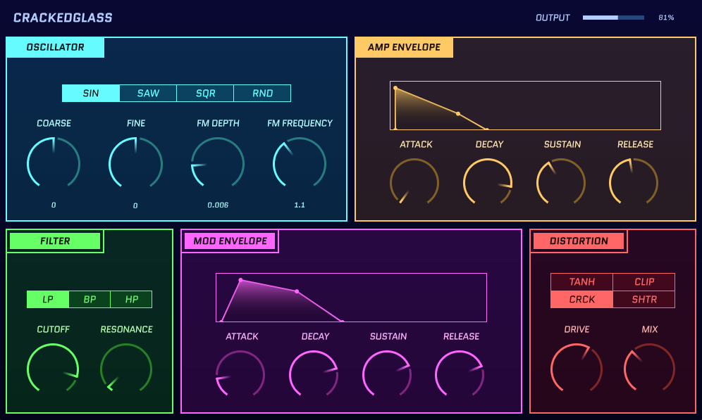

# CrackedGlass

## how 2 install
CrackedGlass is still early in its development, and currently not intended for a final release. As such, it is undoubtedly riddled with bugs and unpredictable dark sorcery. However, you are still welcome to compile and try it out, at the risk of your own silicon and eardrums:

### Install Using CMake
1. Build the project in CMake using your generator/IDE of choice:
   
   `cmake -B Builds -G <your generator/IDE>`
 2. Open the generated solution file in your IDE.
 3. Select your target of choice (standalone, VST3, or AU), and build the plugin.

### Install Using the Projucer
1. Download and install [JUCE and the Projucer](https://juce.com/download/).
2. In the Projucer, open `crackedGlass.jucer`, and click `Save and open in IDE`.
3. Select your target of choice (standalone, VST3, or AU), and build the plugin.
